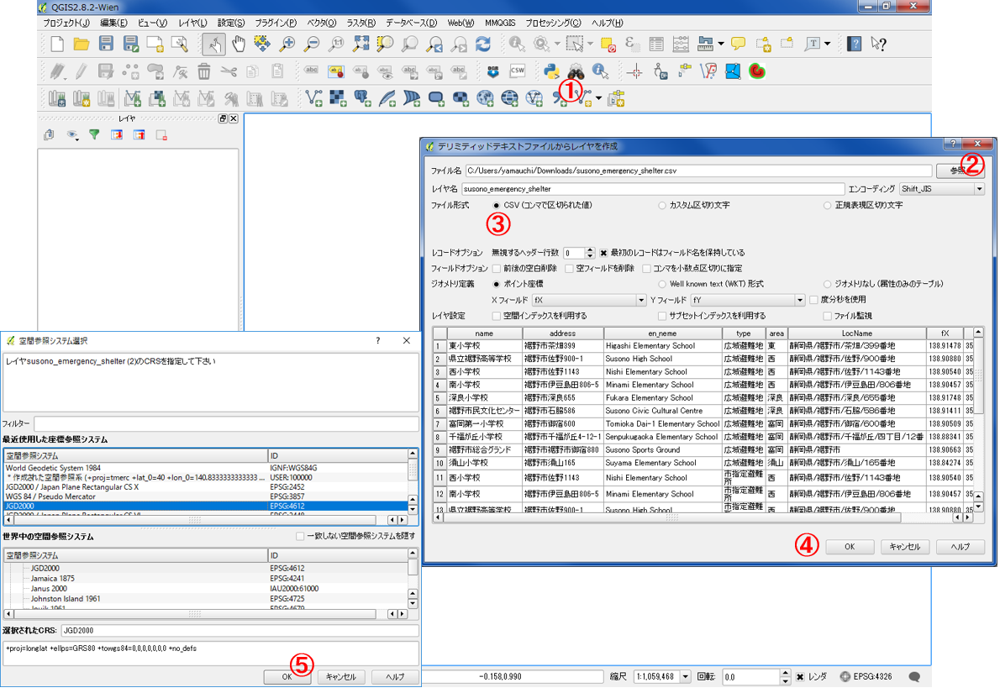

# 空間データ
　本教材は、「空間データ」の実習用教材です。GISソフトウェア（QGIS）を用いて、空間座標の変換、ジオリファレンス、ジオコーディングについて解説しています。
講義用教材として、[地理情報科学教育用スライド（GIScスライド）]の3章が参考になります。  
　課題形式で使用する場合は、本教材を一読した後、[課題ページ]へお進みください。GIS初学者は、本教材を進める前に[GISの基本概念]の教材を確認しておいてください。本教材を使用する際は、[利用規約]をご確認いただき、これらの条件に同意された場合にのみご利用下さい。

[地理情報科学教育用スライド（GIScスライド）]:http://curricula.csis.u-tokyo.ac.jp/slide/3.html
[利用規約]:../../../master/利用規約.md

**Menu**
-------
- [空間座標の変換(測地系変換、投影変換)](#空間座標の変換(測地系変換、投影変換))
- [ジオリファレンス](#ジオリファレンス)
- [ジオコーディング](#ジオコーディング)

**使用データ**

- 政府統計の総合窓口([e-Stat])甲府市行政区画日本測地系と世界測地系（緯度経度）のシェープファイルを利用

- [鯖江市オープンデータ]　古地図007を利用（出典：越前鯖江５万石　ふるさと史跡紹介（2002年　鯖江地区まちづくり推進協議会　発行））

- [裾野市オープンデータ]　広域避難地・市指定避難所データ（出典:[広域避難地・市指定避難所]、裾野市、クリエイティブ・コモンズ・ライセンス 表示 2.1（http://creativecommons.org/licenses/by/2.1/jp/） ））を教材用に加工（緯度経度などを削除）し利用

- 国土地理院　[地理院タイル]

**スライド教材**  
スライドのダウンロードは[こちら](../../../../raw/master/GISオープン教材/08_空間データ/空間データ.pptx)

-------
## 空間座標の変換(測地系変換、投影変換)
　地理空間情報は、測地系と座標系に基づいた位置情報を保持しています。測地系や座標系は様々なものがあります。複数のデータを扱う場合や地図上の単位に合わせて、変換が必要になります。以下では、QGISでの変換手法を解説しています。

※QGIS2.8.4では、JGD2011が選択できないため、JGD2000を割り当てている。

### 測地系変換　
政府統計の総合窓口([e-Stat])甲府市行政区画の日本測地系データを用いて、日本測地系から世界測地系へ変換する手法について解説しています。甲府市行政区画データ（日本測地系と世界測地系　緯度経度）をダウンロードし、以下の処理を試してください。  

※今回の場合は、[e-Stat]からデータをダウンロードする際に統計データが不要なため、統計データは適当なものを選択すること。  

QGISで異なる測地系のデータを読み込む  

① ベクトル読み込みボタンをクリックし、ベクタレイヤを追加する。  
②「ブラウズ」から、ダウンロードした日本測地系と世界測地系のshapeを読み込む。  
③「開く」 をクリック。  

QGISが自動で、擬似的な位置あわせをしてしまうため、オンザフライ投影機能をオフにする。  

① 右下のEPSGのボタンをクリック  
② チェックをはずし、オンザフライ投影を無効にする。  

先ほどまで同じ位置に表示されていたデータが、測地系が異なるためずれて表示される。  
  

それぞれのレイヤの上で右クリックして、プロパティ（一般情報のタブ）から座標系を確認する。  

測地変換を実行し、新規にデータを作成する。

① プロパティから「名前をつけて保存する」をクリックする 。  
② 新規レイヤの出力先と名前を選択する。    
③ CRSのボタンをクリックし、変更したいCRSを選択（今回はJGD2000）してOKをクリックする。  
④ OKをクリックする。  

測地系がJGD2000に変換された。  

### 投影変換

地理座標系から投影座標系の平面直角座標系へ変換する。  

① プロパティから「名前をつけて保存」をクリックする。  
② 新規レイヤの出力先と名前を選択する。  
③ CRSのボタンをクリックし、変更したいCRSを選択（JGD2000 / Japan Plane Rectangular CS Ⅷ）してOKをクリックする。  
④ OKをクリックする。  

測地系が（JGD2000 / Japan Plane Rectangular CS Ⅷ）に変換された。  
※平面直角座標系へ変換する場合に、○○系と指定する必要がある。それについては、国土地理院の[平面直角座標系の対象表]を参考にする。  

[▲メニューへもどる]    

## ジオリファレンス
　ジオリファレンスは、位置情報をもたない画像などのデータに位置情報を持たせる際に用いる手法です。  
　以下では、鯖江市のオープンデータより古地図007をダウンロードし、QGISのジオリファレンサーで読み込み、地理院タイルをもとにGCPを取得し、位置あわせを行う手法について解説します（[位置合わせ用のshpファイル](https://github.com/yamauchi-inochu/demo/raw/master/GISオープン教材/課題/sample/sabae_sample.zip)を読み込んでおくと良い）。

まず、QGISを起動し、[位置合わせ用のshapeファイル]を読み込む。  
次に、[地理院タイル]の標準地図を読み込む。地理院タイルの使い方は、[QGISビギナーズマニュアル]を参照する。  
位置合わせをするために、ラスタからジオリファレンサーを起動する。  
  

ジオリファレンサーで位置合わせしたいラスタを読み込む。  
今回の場合は、[鯖江市オープンデータ]の古地図データの項目からからダウンロードした古地図007(画像の上で右クリックし名前をつけて保存)を読み込む。  
  
① ラスタの読み込みボタンをクリックし、ラスタを選択する。  
② 座標系を選択し、OKをクリックする。  

※座標系は、[位置合わせ用のshpファイル]に合わせて、世界測地系平面直角座標系のⅥ系に設定する。  

以下のように、ジオリファレンサーにラスタの読み込みができた。  
  

### GCPの作成
QGISでジオリファレンスをする場合、位置情報を示すGCPを作成します。GPCは画像の端あたりをあわせて、おおまかな位置合わせをした後、偏りがでないように細部で作成していきます。以下では、その手法について解説しています。  

画像データに位置情報を付加するために、GCPの作成を行う。
  
① GCPを追加するボタンをクリックする（削除する際は、右隣のボタン、地図の移動は手のボタンを用いる）。  
② ジオリファレンサーで入力したラスタ（古地図）の代表点（地理院地図と古地図で類似する地点や曲がり角など）をクリックする。  
③「マップキャンバスより」　をクリックする。  
　※座標がわかってる場合は座標値を入力する。  
④ ジオリファレンサーで作成した古地図の代表点と同じ地点をQGISで表示している地理院タイル上でクリックする。  

ジオリファレンサーで表示されたラスタの上にGCP（座標値をもった点）が表示され、GCPテーブルに詳細が表示される。  
  

同じ作業を行いGCPを増やしていく（GCPの位置に偏りがでないように、最初に画像の4隅に近い部分を合わせると良い）。  
ある部分のみGCPが集中しすぎるということが、起きないように注意しながら作業を進めていく。  
※ GCPテーブルのresidualの値の大きいものを削除すると上手く合う場合が多い。  
  

### ラスタの出力

複数点のGCPの取得ができたら、以下のように位置情報をもった古地図の出力を実行する。  
  
① 変換の設定をクリックする。  
② 線形を選択する。  
③ キュービックを選択する。  
④ 新規レイヤの出力先と名前を入力する。  
⑤ SRSを選択する。  
⑥ OKをクリックする。  

右向き三角のボタンをクリックすると、QGISにラスタが表示される。
  

下の図のように、古地図に位置情報を付加することができた。
※下の図は処理の結果が見やすいように、古地図の透過性を古地図007のプロパティ>透過性から調整している。  
  

[▲メニューへもどる]   

## ジオコーディング
　ジオコーディングは、住所や緯度経度などの情報を保持したテキストファイル等を用いてGISで扱えるデータを作成する手法です。以下では、裾野市広域避難地・指定避難所のデータを用いて、住所と経緯度からジオコーディングをする手法をについて、2つのジオコーディングサービスを利用して解説しています。  

※ 裾野市広域避難地・指定避難所のデータを加工した実習用サンプルデータ、[susono_emergency_shelter.csv]が利用できます。

### Google Maps Geocoding APIを利用する
#### 住所からジオコーディングする
Google Maps Geocoding APIを利用したサイトにアクセスし、裾野市広域避難地・指定避難所の住所を用いてマッピングを行う。  

[susono_emergency_shelter.csv]をダウンロードする。  
※ このデータは、[Link data](http://linkdata.org/work/rdf1s1009i)からダウンロードし、実習用に加工したものである。  
  

[Google Maps Geocoding API]を利用した、位置情報取得サイトはいくつかあります。
今回は、埼玉大学の谷謙二先生が提供している[KTGIS.net]のジオコーディングサービスを利用する。

[KTGIS.net]にアクセスし、上のタブからGeocodingをクリックする。
  

住所情報をもとにジオコーディングをしていく。
  
① 避難所をまとめたCSVから、コピーした住所を張り付ける。  
② 表示をクリックする。  

サイトの下段にある地図の上ポイントが表示される。  
情報出力テキストボックスから、マーカーの緯度経度、kmlデータ、最近隣距離などが出力できる。  
  

### CSVアドレスマッチングサービスを利用する
#### 経緯度からジオコーディングする
東京大学空間情報科学研究センターが提供する[CSVアドレスマッチングサービス]を利用して、住所から緯度経度を求めることができる。  
以下では、その手法について解説している。

[susono_emergency_shelter.csv]の住所情報をもとにジオコーディングをしていく。
  
① 全国街区レベル（緯経度・世界測地系）を選択する。  
② 住所を含むカラムに 2 を入力（エクセルでみたときの住所が入っている箇所に相当する）する。  
③ シフトJISコード（SJIS）を選択する。  
④ 避難所をまとめたCSVを選択する。  
⑤ 送信をクリックする。  
  その後、保存のウインドウが表示される。  

#### QGISで緯度経度つきのCSVデータを表示する
以下では、アドレスマッチングで取得したデータをQGISで表示する手法について解説しています。[CSVアドレスマッチングサービス]で取得したCSVを利用し、以下の処理を試してください。

QGISでテキストファイル（CSVファイル）を読み込む。  
  
① テキストファイル読み込みボタンをクリックする。  
② ダウンロードしたデータを選択する。  
③ CSVにチェックを入れ、Xフィールドに経度、Yフィールドに緯度をそれぞれ指定する。  
④ OKをクリック  
⑤ JGD2000を選択しOKをクリック

シェープファイルとして、新規ファイルを作成する。  
  
① プロパティから名前をつけて保存をクリックする。  
② 新規レイヤの出力先と名前を選択する。  
③ CRSのボタンをクリックし、変更したいCRSをJGD2000としてOKをクリックする。  
④ OKをクリックする。  

以下のように、裾野市の広域避難地・市指定避難所データが地図上に表示できた。  
ポイントデータにラベルを付ける場合は、プロパティ>ラベル から設定を行う（詳しくは、[QGISビギナーズマニュアル]を参照）。  
  

[▲メニューへもどる]  

#### この教材の[課題ページ]へ進む

**その他のライセンス**  
本教材で利用しているキャプチャ画像の出典やクレジットについては、[その他のライセンスについて]よりご確認ください。

[e-Stat]:http://www.e-stat.go.jp
[地理院タイル]:http://maps.gsi.go.jp/development/ichiran.html
[その他のライセンスについて]:../その他のライセンスについて.md
[▲メニューへもどる]:空間データ.md#menu
[QGISビギナーズマニュアル]:../QGISビギナーズマニュアル/QGISビギナーズマニュアル.md
[Google Maps Geocoding API]:https://developers.google.com/maps/documentation/geocoding/intro?hl=ja
[KTGIS.net]:http://ktgis.net/gcode/geocoding.html
[裾野市オープンデータ]:http://www.city.susono.shizuoka.jp/ma/organization/susono-open-data.php
[鯖江市オープンデータ]:http://www.city.sabae.fukui.jp/pageview.html?id=12768
[GISの基本概念]:../01_GISの基本概念/GISの基本概念.md
[CSVアドレスマッチングサービス]:http://newspat.csis.u-tokyo.ac.jp/geocode-cgi/geocode.cgi?action=start
[susono_emergency_shelter.csv]:https://github.com/yamauchi-inochu/demo/blob/master/GISオープン教材/課題/sample/susono_sample.zip?raw=true
[平面直角座標系の対象表]:http://www.gsi.go.jp/LAW/heimencho.html
[課題ページ]:../課題/課題ページ/空間データ.md
