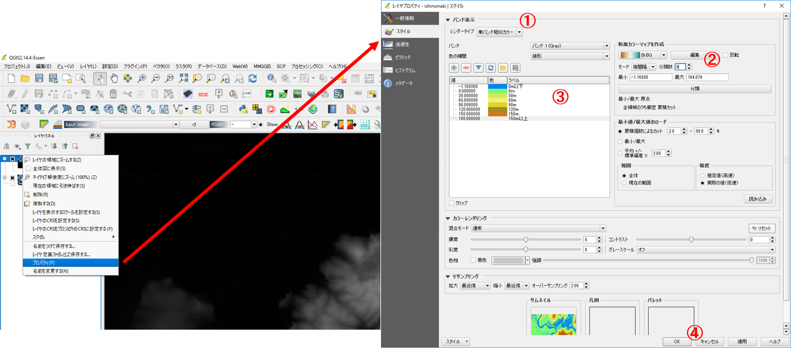
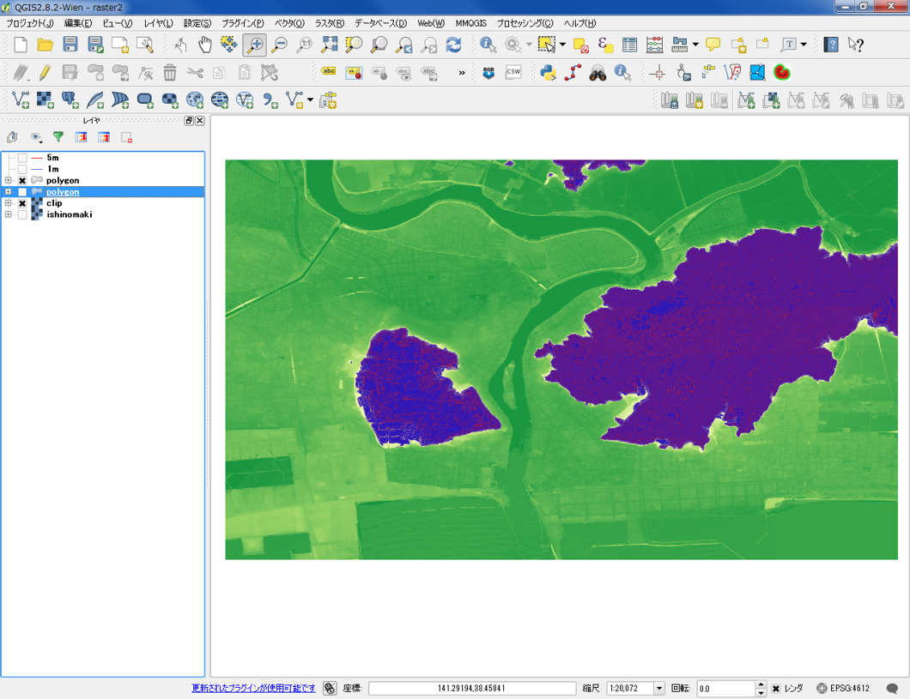

# 空間データの統合・修正
　本教材は、「空間データの統合・修正」の実習用教材です。GISで用いられるラスタデータ（以下、ラスタという）とベクトルデータ（以下、ベクタという）の統合、修正、変換などデータの編集手法について解説しています。ソフトウェアには、無償で利用できるQGISを用いています。
　課題形式で使用する場合は、本教材を一読した後、[実践ページ](../実習/実習ページ/空間データの結合・修正.md)へお進みください。本教材を使用する際は、[利用規約]をご確認いただき、これらの条件に同意された場合にのみご利用下さい。

[地理情報科学教育用スライド（GIScスライド）]:http://curricula.csis.u-tokyo.ac.jp/slide/3.html
[利用規約]:../../../master/利用規約.md

**Menu**
---------
* [ラスタのモザイクとクリップ](#ラスタのモザイクとクリップ)
* [等高線の抽出](#等高線の抽出)
* [ラスタをベクタへ](#ラスタをベクタへ)
* [新規ベクタの作成](#新規ベクタの作成)
* [ベクタの修正](#ベクタの修正)
* [ベクタをラスタへ](#ベクタをラスタへ)

**使用データ**
* 国土地理院　「[基盤地図情報]　基本項目　石巻周辺
（574142、574143、574152、574153）
 [基盤地図情報]　数値標高モデル　5ｍメッシュ　石巻周辺
（574142、574143、574152、574153）」
* 国土交通省国土政策局「[国土数値情報]（宮城県　郵便局データ）」を加工し、利用
* [地理院タイル]（国土地理院）

[基盤地図情報]:http://www.gsi.go.jp/kiban/
[国土数値情報]:http://nlftp.mlit.go.jp/ksj/index.html
[地理院タイル]:http://maps.gsi.go.jp/development/ichiran.html
>[既存データの地図データと属性データ]教材と[ラスターデータの分析]教材を参考に、基盤地図情報サイトからDEMをダウロードと変換を行ってください。  

**スライド教材**  
スライドのダウンロードは[こちら](../../../../raw/master/GISオープン教材/10_空間データの統合・修正/空間データの結合・修正.pptx)

------

## ラスタのモザイクとクリップ
　以下では、[基盤地図情報]からダウンロードした5mDEMを用いて、ラスタデータの結合と任意範囲での切り抜きの解説を行っています。DEMは、Digital Elevation Modelの略であり、各セルごとに標高値を保持しるデータです。

  
ラスタを読み込むボタンをクリックして、変換したラスタを全て読み込む。

### ラスタのモザイク
  
ラスタ＞その他＞結合  
① 入力ファイルを選択する。  
② 出力先とファイル入力する。  
③ ＯＫをクリックする。  

＊データがない値を0とせずにNULL値として扱いたい場合は、-9999を設定する。
プロパティ＞透過性からデータ無しとする値に-9999を設定

  
ラスタが結合できた（モザイク）

①　プロパティ ＞ スタイルから、レイヤタイプを単バンド疑似カラーにする。  
②　新規カラーマップを作成から等間隔モードにし、分類数と配色を設定し、「分類」をクリックする。  
③　各値上でクリックを行い分類数に応じて値を書き換える（ラベルも書き換える）。  
④　適用をクリックし、配色を確認後OKをクリックする。  

  
プロパティを開いて標高ごとに色わけを変更する。

### ラスタのクリップ
  
ラスタ＞抽出＞クリッパー  
① 入力ファイルを選択する。  
② 出力先とファイル入力する。  
③ 地図から切り抜きたい範囲を選択する。  
④ ＯＫをクリックする。

＊データがない値を0とせずにNULL値として扱いたい場合は、-9999を設定する。  
プロパティ＞透過性からデータ無しとする値に-9999を設定

  
ラスタが切り抜けた。  
切り抜いたラスタの配色を変更する。

[▲メニューへもどる]  
[▲メニューへもどる]:空間データの統合・修正.md#menu

## 等高線の抽出
　作成したラスタデータは、各セルごとに標高値を保持しているため値を用いて、等高線を作成することができる。以下では、等高線を作成する手法について解説しています。  

   
ラスタ＞抽出＞等高線　　
① 入力ファイルを選択する。  
② 出力先とファイル入力する。  
③ 等高線の間隔を入力（単位はｍ）する。  
④ チェックを入れる  
⑤ ＯＫをクリックする。  

  
同じ方法で1mの等高線も作成する。

  
1mと5mの等高線が出力された。

[▲メニューへもどる]

## ラスタをベクタへ
　GISでは、処理の内容やデータの表現のため、ラスタデータやベクタデータを使い分けて使用します。以下では、ラスターデータをベクタデータに変換する手法について解説しています。

ラスタをベクターに変換する。
  
ラスタ＞変換＞ポリゴン化（ラスタのベクタ化）  
① 入力ファイルを選択する。  
② 出力先とファイル入力する。  
③ チェックを入れる。  
④ ＯＫをクリックする。  

  
ラスタがベクタに変換された。

##### ポリゴンから特定の値（例：10m以上の地域）を表示する場合
  
プロパティ>スタイル  
「段階に分けられた」を選択し、カラムに「DN」値を指定する。  
分類数を1にし、「分類」をクリックする。値をクリックし10-最大値を入力し、OKをクリックする。  

[▲メニューへもどる]

## 新規ベクタの作成
　GISでは、第3者が作成した既存のデータだけでなく、自作したデータを作成や解析等をすることができます。以下では、新規にベクトルデータを作成する手法について解説しています。

①　レイヤ＞レイヤの作成＞新規シェープファイルレイヤを選択する。  
②　作成したいレイヤのタイプを選択する。  
③　エンコーディングと座標系を設定する。  
④　新規ポイントに追加したい属性を「新しい属性」から設定する。  
「名称」はカラム名、「タイプ」はデータ型にあわせる、「幅」と「精度」は入力するデータによる。  
「タイプ」・・・値が整数ならInteger、小数を含むならReal、テキストならStringとなる。    
「幅」＞桁数、「精度」＞表示する小数の位  
（上の画像のように標高値を設定すると、幅が4桁で小数第3位まで表示するため、9.999以上の値が入力できなくなる）  
⑤　OKを押し保存先を選択する。  

編集モード切替アイコンから、編集モードをオンにして任意の場所でクリックする（ポリゴンやラインの追加は、最後に右クリックし閉じる）。  
地物属性を入力するウィンドウが立ち上がるため、各項目に値を入力する。  
OKをクリックするとポイントが作成される。ポイントの追加が完了したら、編集モード切替アイコンをクリックし、編集を保存する。  

## ベクタの修正
　GISでは、既存のデータを編集することができます。地物の位置が実際とは異なっている場合や解析用に属性を編集したい場合などに、既存データを改変することがあります。以下では、ベクトルデータの修正について解説しています。

### ベクタの修正 ①ポイント
以下では、石巻門脇郵便局と石巻中央郵便局のポイントが実際の位置とは異なっていると仮定して、位置を修正する手法について解説しています。  

  
QGISで国土数値情報でダウンロードした宮城県の郵便局のデータを読み込む。背景地図に地理院地図を利用（タイルレイヤプラグイン）する。

#### ポイントの削除
  
① 編集したいレイヤを選択する。  
② 編集モードをクリックする。  
③ 地物の選択をクリックする。  
④ 消したいポイントをクリックする。  
※編集が終わったら編集の保存ボタンををクリックして一時保存する。

  
ポイントが削除された。

#### ポイントの移動
  
① 編集したいレイヤを選択する。  
② 編集モードであることを確認する。  
③ 地物の移動をクリックする。  
④ ポイントを動かす。  
※編集が終わったら編集の保存ボタンををクリックして一時保存する。

  
ポイントが移動できた。

#### ポイントの追加
  
① 編集したいレイヤを選択する。  
② 編集モードであることを確認する。  
③ ポイントの追加をクリックする。  
④ 追加したい地点をクリックする。  
⑤ 値を入力し、ＯＫをクリックする。※　属性テーブルを参考にする

#### 属性テーブルを編集する
  
① 編集したいレイヤを選択する。  
② 編集モードであることを確認する。   
③ 属性テーブルを開く。  
④ テーブルを編集する。  
※編集が終わったら編集の保存ボタンををクリックして一時保存する。

  
編集が完了したらたら編集ボタンをクリックすると編集モードが終了する。  
※メッセージが出る場合は、保存をクリックする。

### ベクタの修正 ②ラインとポリゴン
以下では、ラインとポリゴンの編集について解説しています。対象地域のポリゴンがある場合は、データを読み込みます。なければ、空中写真などから建物等のトレースを行い、任意の形のポリゴンを新規作成して下さい。

#### ポリゴンの修正
  
ポリゴンの形を修正する。

  
① 編集したいレイヤを選択する。  
② 編集モードをクリックする。  
③ ノードツールをクリックする。  
④ 頂点を編集する。  

  
頂点を移動するとポリゴンの形状が変わり、線上でダブルクリックすると頂点が増える。

#### 新規ポリゴンを連結させる
　ポリゴンやラインを連結させる場合には、そのラインやポリゴンを構成する頂点を重ねる必要があります。以下は、見た目で重ねた結果ですが実際には重なっていないことが確認できます。

  
ポリゴンの作成ボタンをクリックし、新しいポリゴンを作成する。

  
連結させるようにポリゴン同士の頂点を重ねる。  
※この方法では、ポリゴンを連結することはできない。
  

#### 頂点の重ね合わせ
　以下では、万石浦に橋を建設することを仮定して、QGISで頂点を重ねる手法について解説しています。

  
頂点の連結を確認する。
編集したいレイヤを選択し、ノードツールをクリックする。

  
編集モードで、頂点を移動する（保存はしない）。  
ラインやポリゴンは頂点でつながっている。

スナップオプションの設定を変えて、頂点に重ねられるようにする。
  
設定＞スナップオプション  
①　編集したいレイヤにチェックを入れる。  
②　頂点と線分を選択する。  
③　許容範囲を入力（今回は20）する。  

#### ラインと頂点の編集（万石浦に橋を作成）

  
レイヤ＞新規シェープファイルレイヤ
① ラインを選択する。  
② エンコーディングを選択する。  
③ ＣＲＳを選択する。  
④ ＯＫをクリックする。  
⑤ 出力先とファイル名を入力し保存する。  
※今回は、属性を追加しない。

  
新規のラインが追加された。  
プロパティからスタイルを変更しておく。

#### ラインのレイヤを新規に作成する
万石浦に橋（ライン）のレイヤを新規に作成する。
  

  
編集モードで、水涯線にカーソルをあてるとカーソルの色が変化する。

  
編集が完了したらたら編集ボタンをクリックすると編集モードが終了する。  
※メッセージが出る場合は、保存をクリックする。

  
頂点が重なっていることが確認できる。

[▲メニューへもどる]

## ベクタをラスタへ
　GISでは、処理の内容やデータの表現のため、ラスタデータやベクタデータを使い分けて使用します。以下では、石巻市周辺の水域ポリゴンをラスタへ変換する手法について解説しています。  
　また、以下ではラスタ変換用に加工した水域ポリゴンを使用しています。  

  
※加工した水域ポリゴン  
→属性テーブルを整理し、1列にしておく。  
→選択して川水域ごとに値を入れる。  
→シングルパートをマルチパートにする。  

  
ラスタ＞変換＞ラスタ化（ベクタのラスタ化）  
① ベクタを選択する。  
② 色分けに使う、属性フィールドを選択する。  
③ 出力先とファイル名を入力する。  
④ チェックする。  
⑤ ＯＫをクリックする。  

  
水域ポリゴン（ベクタ）がラスタに変換された。

  
色分けすると主な水域ごとに色分けができる。
拡大するとラスタであることが確認できる。

[▲メニューへもどる]

**その他のライセンス**  
本教材で利用しているキャプチャ画像の出典やクレジットについては、[その他のライセンスについて]よりご確認ください。
[その他のライセンスについて]:../その他のライセンスについて.md

[ラスタデータの分析]:../15_ラスタデータの分析/ラスタデータの分析.md
[既存データの地図データと属性データ]:../07_既存データの地図データと属性データ/既存データの地図データと属性データ.md
