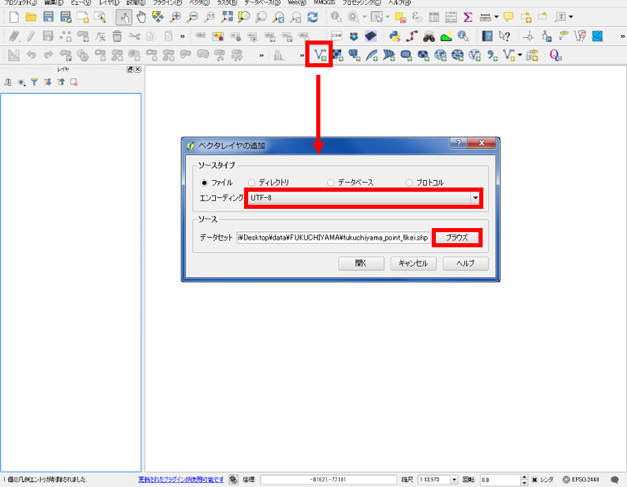
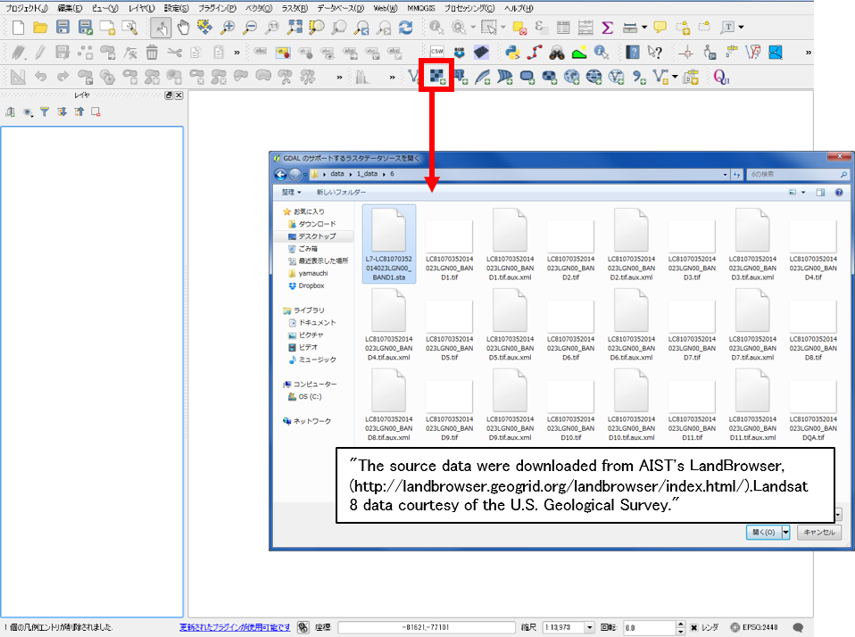
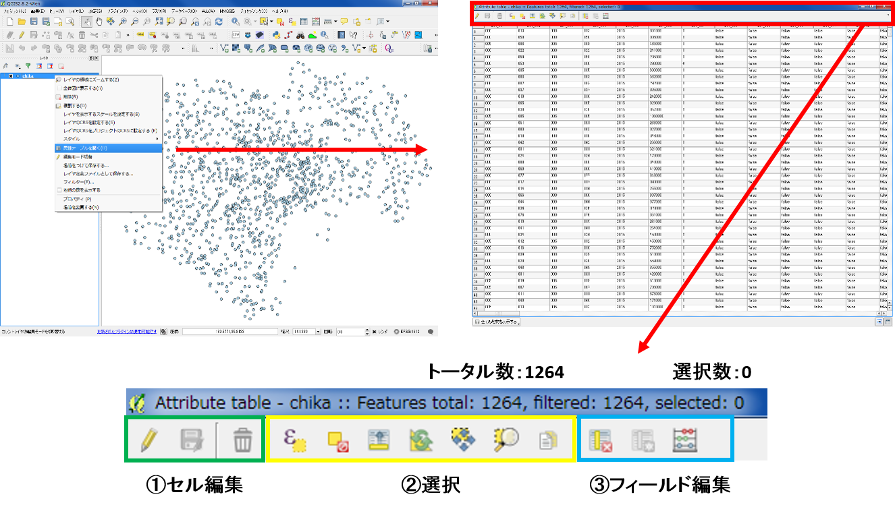
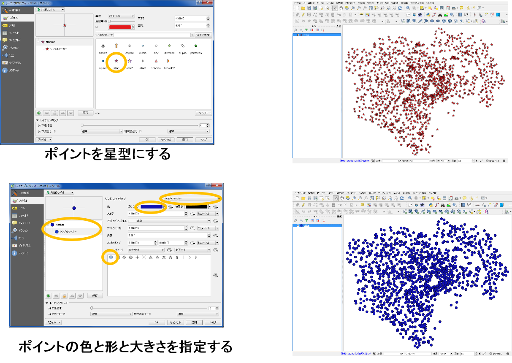
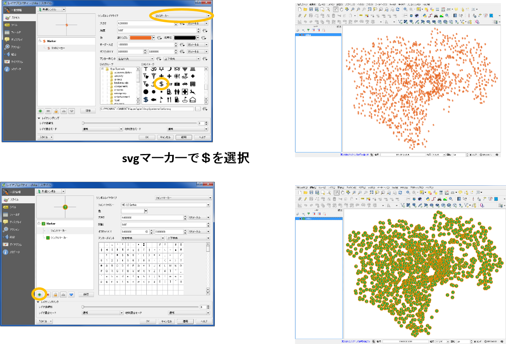
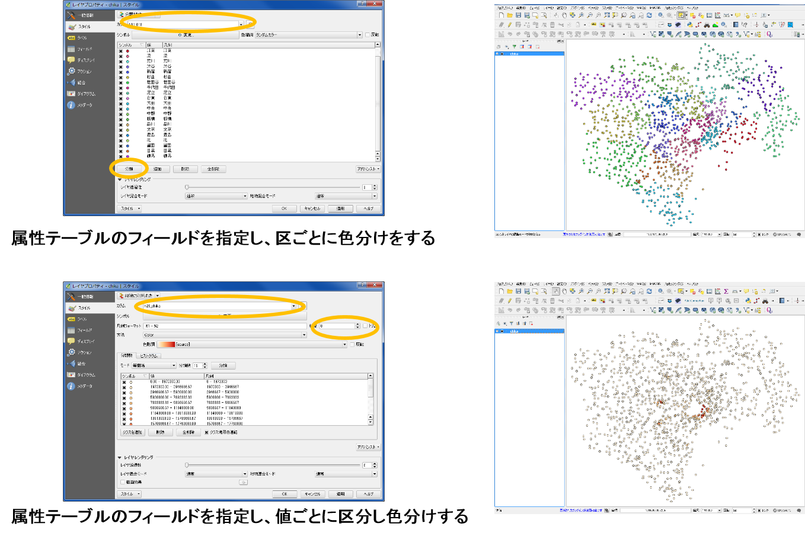
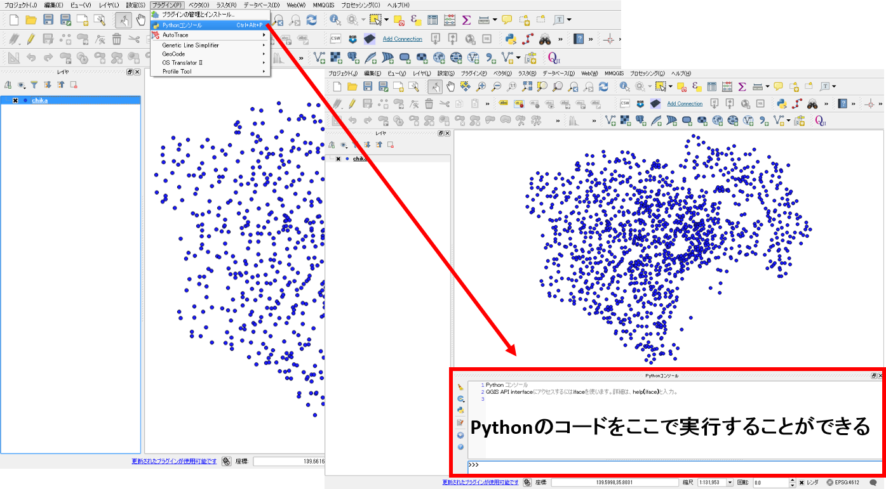

# QGISビギナーズマニュアル
　本教材は、QGIS入門者向けの実習用教材です。QGISの基本操作として、データの読み込み、シンボルの変更、地図のレイアウトなどについて解説しています。  
　課題形式で利用する場合は、[課題ページ](../課題/課題ページ/GIS入門.md)をご利用ください。本教材を使用する際は、[利用規約]をご確認いただき、これらの条件に同意された場合にのみご利用下さい。

[利用規約]:../../../master/利用規約.md

**Menu**
----------
* [QGISとは？](#QGISとは？)
* [インストールする](#インストールする)
* [起動する](#起動する)
* [ウインドウの確認](#ウインドウの確認)
* [各種ボタンについて](#各種ボタンについて)
* [データの読み込み](#データの読み込み)
* [機能説明](#機能説明)
* [属性テーブル](#属性テーブル)
* [プロパティ](#プロパティ)
* [Python入門](#python入門)
* [データの保存形式](#データの保存形式)
* [プラグイン](#プラグイン)
* [地図のレイアウト](#地図のレイアウト)
* [参考ページの紹介](#参考ページの紹介)

**使用データ**  
　実習をはじめる前に、以下のデータをダウンロードしてください。この実習では、以下のデータを同時に読み込まないようにしてください。別のデータを読み込む際は、QGISを再起動してください。  

* 国土交通省国土政策局「[国土数値情報]（東京都　地価公示データ）」
>地価公示のデータは、東京23区の行政区ポリゴンをもとにクリップしたものです。クリップは、[基本的な空間解析]の教材にまとめています。GIS初心者の方は、クリップをせずに、もとデータ（東京都全体のデータ）を読み込んで作業を進めてください。ダウンロードの手法は、[既存データの地図データと属性データ]の教材にまとめています。  

* [福知山豪雨災害聞き取り調査データ](https://github.com/yamauchi-inochu/demo/raw/master/GISオープン教材/実習/sample/fkuchiyama_sample.zip)　([福知山豪雨災害防災マップ](http://opentextmap.org/library/?p=2808)　© 福知山豪雨災害防災マップ を加工し作成）

**スライド教材**  
スライドのダウンロードは[こちら](https://github.com/yamauchi-inochu/demo/raw/master/GISオープン教材/QGISビギナーズマニュアル/QGISビギナーズマニュアル.pptx)

----------

## <a name = "QGISとは？">QGISとは？
　QGISは、オープンソースかつ無償で利用できるGIS（GNU General Public Licenseで提供）です。 Windows,Mac,Linux,Unix, Androidなど様々な環境で動作します。様々なプラグインが用意されていることや、GRASSやPostGISなど他のオープンソースGISとの連携して使用することで、多様な分析が可能です。GISの基本操作を網羅しているだけでなく、Web上に多数のマニュアルがアップロードされているため、GIS学習がしやすいソフトウェアです。  

>( http://qgis.org/ja/site/about/index.html を参考に作成 )

[▲メニューへもどる]  
[▲メニューへもどる]:QGISビギナーズマニュアル.md#menu

## インストールする
　QGISは、最新版と1年間のバグ修正のサポートがあるLTR版がある。本教材では、旧LTR版のQGIS2.8を中心に構成している。下記に従って、QGISをインストールする（LTR版2.8を推奨）。  

### 最新版のインストール
  
[QGIS](http://qgis.org/ja/site/index.html)の公式ホームページから、QGISをダウンロードする。  
PCの環境にあわせて、32bit版か64bit版を選択してダウンロードする(LTR版を推奨)。
ダウンロードが終了したら、.exeファイルを実行しインストールを行う。  

### 旧版のインストール
**本教材ではQGIS2.8を基本に構成している**  

QGISのサイト（http://qgis.org/ja/site/）を開き、「ダウンロードする」　をクリックする。
全てのリリースのタブに切り替えて、「古いバージョンのダウンロード」をクリックする。本教材で中心になっているQSIS2.8版（最終リリース版）をダウンロードする。

[▲メニューへもどる]  

## 起動する
  
　デスクトップのQGISアイコンをダブルクリックし、QGISを起動する。起動するのに少し時間がかかるため待機する。

[▲メニューへもどる]  

## ウインドウの確認
  

[▲メニューへもどる]  

## 各種ボタンについて
  
①QGISファイルを保存  
②名前をつけてQGISファイルを保存  
③地図移動  
④地図の拡大と縮小  
⑤選択領域にズーム  
⑥動作の前後移動  
⑦地物情報表示  
⑧選択と選択取り消し  
⑨長さ、面積計測（手動）  
⑩レイヤ編集  
⑪ベクタレイヤの読み込み  
⑫ラスタレイヤの読み込み  
⑬テキストファイルの読み込み  

  

[▲メニューへもどる]  

## データの読み込み
　GISで読み込むデータは、大きく分けてベクトルデータとラスタデータがある。詳しくは[ベクトルデータとラスタデータ](../01_GISの基本概念/GISの基本概念.md)を参照してください。QGISでは、以下のようにデータによって読み込む手法が変わる。

### ベクトルデータ読み込み
  
　ベクタデータを読み込むアイコンをクリックするとベクタレイヤ追加ウインドウが表示される。
文字コードにあわせてエンコーディングを設定し、ブラウズからファイルを選択する。

### ラスタデータの読み込み
  
　ラスタデータを読み込むアイコンをクリックし、読み込みたいラスタデータを選択する。

### テキストデータ読み込み
　GISでは、テキストデータをテーブル結合したり、位置情報を用いてベクトルデータなどに変換することができる。QGISでは、以下の手法でテキストデータを読み込む。

  
　テキスト読み込みのアイコンから、CSVファイルを読み込む。
参照からファイルを選択し、ファイル形式をCSVにする。X,Yフィールドに対応する緯度経度があれば指定し、緯度経度がなければジオメトリなしにチェックをする。

[▲メニューへもどる]  

## 機能説明
  
プロジェクト：QGIS（.qgs）ファイルの保存や読み込み、地図のレイアウト、エクスポートができる。  
編集：ベクターレイヤの編集ができる。編集状態になると、アクティブになる。

  
ビュー：地図の移動や拡大、縮小など、地図画面の操作ができる。  
レイヤ：ベクターやラスタなどのレイヤが追加できる。
ポイント、ライン、ポリゴン新規レイヤの作成もできる。

  
設定：オプションから、プロジェクトの設定やスナップオプションが設定できる。  
プラグイン：プラグインの管理とインストールができる。python入力画面が開ける。

  
ベクタ：斜面方位図や陰影図の作成などラスタに関する処理ができる。  
ラスタ：バッファやクリップなどベクタに関する処理ができる。

  
データベース：PostGISなどのデータベースへの接続やeVisプラグインによる外部ファイルとの連携が可能。  
Web：背景地図の設定やweb地図の書き出しができる（プラグインによる）。

  
プロッセッシング：他のGISソフトウェアと連携して操作ができる（R,GRASS,SAGAなどがQGIS内で処理できる）。  
ヘルプ：QGISのヘルプが確認できる。

[▲メニューへもどる]  

## 属性テーブル
　ベクトルデータは、位置情報のほかに属性情報を保持しています。以下では、QGISでデータ東京都の地価公示データを表示し、属性テーブルの確認や属性値を用いた分類について解説しています。  

  
　データを読み込み、左の画面からレイヤの上で右クリックし、属性テーブルを開き、属性を確認する。

  
　属性テーブルで選択したものは、地図上で黄色で表示される。
選択アイコンで地図上のレイヤを選択した場合は、その属性テーブルが選択される。

[▲メニューへもどる]  

## プロパティ
　QGISでは、プロパティからデータの情報やスタイルの変更ができます。ポイントでは形や大きさ、ラインでは線の形や太さ、ポリゴンでは塗りつぶし色や透過性を変更することができます。また、属性情報でスタイルを分けることもできます。この処理は、表示のされ方が変化するだけで、データそのものの形状や属性等が改変されるものではありません。

  
レイヤウインドウからレイヤを選択し、右クリックでプロパティを表示する。

  
一般情報：座標系を確認したり、文字コード、表示名の変更ができる。
スタイルやラベルからレイヤを整えることができる。

  

  

  

[▲メニューへもどる]  

## <a name = "Python入門">Python入門
　QGISでは、pythonでコードを書いて処理したり、自作したプラグインを使用することができます。以下では、pythonコンソールを用いてコードによる処理について紹介しています。

  
プラグインから、Pythonコンソールを開く。

  
Pythonでは、値やオブジェクトを変数へ代入することができる。  
上記では、tokyo（変数）に‘test’（文字列）を代入した。
そのため、testと入力したら’tokyo’が返される。

  
変数には数値型も代入でき、tokyo=23を代入するしtokyo+1を実行すると24が返される。
文字型との違いは、 ’’があるかないかで区別している。  
この他にリストや辞書が変数に代入できる。

QGISでは、独自のPython関数が用意されており、それを読み込むことができる。
それ以外に、拡張モジュールも多くあり、様々な関数による処理が可能である。
詳しくは、[QGIS API Documentation]を参照。
[QGIS API Documentation]:<http://www.qgis.org/api/index.html>

  
上の図は、Python関数を用いて、アクティブになってるポイントレイヤの個数を集計したもの。  

python関数を用いることで、複数のレイヤを一括で処理することもできます。  
<<<<<<< HEAD
この手法については、[QGIS+python初級](../python初級/python初級.md)で簡単に解説しています。  
=======
この手法については、[QGIS+python入門](../QGIS%2Bpython入門.md)で簡単に解説しています。  
>>>>>>> origin/master

[▲メニューへもどる]  
## データの保存形式
　GISでは、Shapefile（シェープファイル）形式のベクトルデータを用いることが多いです。しかし、使用するソフトウェアやアプリケーションによっては、別の形式のファイルを使用します。QGISでは、以下ののように任意のファイル形式で保存を行うことができます。

  
　レイヤの上で右クリックし名前をつけて保存をクリックする。QGISでは、Shapeファイル以外にも、CSV,KML,GeoJASONなど様々な形式を選択できる。

　KMLは、GoogleEarthで利用できる形式であり、Cesiumなどを利用することで、Web上でも表現できる。

東京駅から東京タワーまでの道のりを表示

　CSVは、カンマで区切られたデータ形式で、座標値をもっていれば
Cartoなどで簡単にWebGISとして表現できる。
  
裾野市オープンデータ　広域避難地・市指定避難所データを加工したものを利用し作成

[▲メニューへもどる]  

## プラグイン
　QGISでは、オフィシャルプラグインリポジトリ等から、様々な拡張機能をプラグインとしてインストールできます。プラグインをインストールすることにより、様々な処理が可能になります。
  
　プラグインから、プラグインの管理とインストールを選択する。  
検索から、インストールしたいプラグインを検索する。例として、以下のような便利なプラグインがある。

  

### TileLayerPluginのインストール
　以下では、プラグインのインストール手法とTileLayerPluginの設定法について解説しています。  
※使用データから、福知山豪雨災害聞き取り調査データをダウンロードし、QGISでシェープファイルを読み込んだ状態にして下さい。

プラグイン＞プラグインの管理とインストールからTileLayerPluginを検索し、プラグインのインストールをクリックする。  
インストールが完了したら、地理院タイルをまとめた[gsi-tiles.zip](https://github.com/yamauchi-inochu/demo/raw/master/GISオープン教材/実習/sample/gsi-tiles.zip)をダウンロードし、任意の場所に保存し、.zipを解凍する。  

web>タイルレイヤプラグインから、プラグインを起動する。タイルレイヤプラグインの設定をクリックし、解凍したgsi-tilesフォルダを外部レイヤディレクトリに指定する。フォルダを指定していることを確認し、OKをクリックすると地理院タイルの一覧が表示される。地理院タイルを使用する際は、[地理院タイルの利用規約](http://maps.gsi.go.jp/help/use.html)に従ってください。

※本教材で用意したtsvファイルは、Minoru Akagi(minoura)氏 が、[GitHub Gist](https://gist.github.com/minorua/7654132) で公開しているtsvファイルを加工し作成したものです。  

一覧から地図を選択し、追加をクリックするとQGISに地図が表示される。ポイントデータが、タイル画像の下に置かれているため、ポイントデータを表示するには、レイヤウィンドウのレイヤを入れ替える必要がある。レイヤの上下の変更方法は、一番上に表示したいレイヤをドラッグし、リスト化されているレイヤウィンドの一番上まで移動する。移動すると、地図上でもレイヤの上下が変更される。  

※レイヤ構造については、[こちら](../01_GISの基本概念/GISの基本概念.md#地物とレイヤ構造)を参照してください。

[▲メニューへもどる]  

## 地図のレイアウト
　QGISでは作成したデータに凡例や縮尺を追加した地図がレイアウトできます。以下では、福知山豪雨災害聞き取り調査データと地理院タイルを用いて地図のレイアウトについて解説しています。

  
プロジェクトから、新規プリントコンポーザを立ち上げ、コンポーザタイトル（地図名など任意）を入力する。  
※データが重ならない場合は、オンザフライ投影がうまくいっていない可能性があるので、QGISを再起動する。その後、サンプルデータ、地理院タイルの順で読み込む（これでもうまくいかない場合は、右下のEPSGと書かれたボタンをクリックし、オンザフライにチェックをつける）。本来は空間座標の変換が必要であるが、この教材は入門編のため、解説していない。空間座標の変換は、[空間データ]の教材を参考にしてください。

### プリントコンポーザ

  
①アイテムの選択と移動　②地図の移動　③地図の追加　④画像の追加　⑤凡例の追加　⑥縮尺バーの追加　⑦地図の更新
※アイテムの削除は編集から行う。

地図、縮尺バー、凡例を追加し、アイテムプロパティで調整する。
  

縮尺バーを選択し、アイテムプロパティで調整する。
  

凡例を選択し、アイテムプロパティで調整する
  
自動アップデートのチェックをはずすと凡例が編集できる。名称の変更、凡例項目の追加と削除ができる。

画像の追加から方位記号を追加する
  
アイテムプロパティの検索ディレクトリをクリックすると様々なイメージが参照できる。  

※デフォルトの状態では、図の赤枠部分をクリックしないと検索ディレクトリが開かない。

  
地図のレイアウトが整ったら、画像としてエクスポートする。

  
画像としてエクスポートした地図を表示する。

### QGISのビュー上に凡例と方位記号を表示する

  
ビューから、地図装飾を選択する。
地図装飾からスケールバー、方位記号を追加する。
それぞれの形式や配置を決め、「方位or縮尺バーを使用」をチェックする。

  
QGISのビュー上に縮尺と方位記号が表示された。

[▲メニューへもどる]  

## 参考ページの紹介
- QGISについて詳しく勉強したい方　QGISユーザーガイド
①http://qgis.org/ja/site/about/index.html    
- QGISとPythonについて詳しく勉強したい方　 PyQGIS 開発者用 Cookbook  
②http://docs.qgis.org/2.2/ja/docs/pyqgis_developer_cookbook/  

[▲メニューへもどる]  

**その他のライセンス**  
本教材で利用しているキャプチャ画像の出典やクレジットについては、[その他のライセンスについて]よりご確認ください。
[その他のライセンスについて]:../その他のライセンスについて.md

[国土数値情報]:http://nlftp.mlit.go.jp/ksj/
[空間データ]:../08_空間データ/空間データ.md
[基本的な空間解析]:../11_基本的な空間解析/基本的な空間解析.md
[既存データの地図データと属性データ]:../07_既存データの地図データと属性データ/既存データの地図データと属性データ.md
