# 既存データの地図データと属性データ
本教材は、「既存データの地図データと属性データの実習用教材」です。GISで利用できる地図データや属性データのダウンロード手法について解説しています。データのダウンロードには、WEBブラウザを用いています。  
講義用教材として、[地理情報科学教育用スライド（GIScスライド）]の2章が参考になります。  

本教材を使用する際は、[利用規約]をご確認いただき、これらの条件に同意された場合にのみご利用下さい。

[地理情報科学教育用スライド（GIScスライド）]:http://curricula.csis.u-tokyo.ac.jp/slide/2.html
[利用規約]:https://github.com/yamauchi-inochu/demo/blob/master/利用規約.md

**Menu**
-----
**国・地方自治体のGISデータのダウンロード**
- [国土交通省のGISデータ基盤地図情報(国土地理院)](#国土交通省のGISデータ基盤地図情報(国土地理院))
- [国土交通省のGISデータ国土数値情報](#国土交通省のGISデータ国土数値情報)
- [環境省のGISデータ](#環境省のGISデータ)
- [総務省のGISデータ](#総務省のGISデータ)
- [その他のGISデータ](#その他のGISデータ)
- [オープンデータ](#オープンデータ)

**スライド教材**  
スライドのダウンロードは[こちら]
[こちら]:https://github.com/yamauchi-inochu/demo/raw/master/Markdown/07_既存データの地図データと属性データ/既存データの地図データと属性データ.pptx

----------
## <a name = 国土交通省のGISデータ基盤地図情報(国土地理院)>国土交通省のGISデータ基盤地図情報(国土地理院)

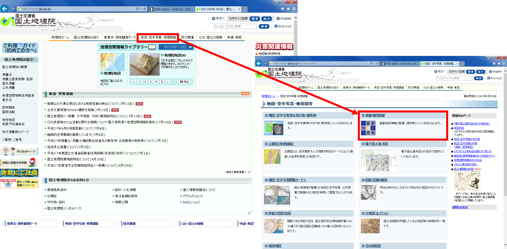
[国土地理院]のサイトにアクセスする。  
地図・空中写真・地理調査をクリックし、基盤地図情報をクリックする。
[国土地理院]:<http://www.gsi.go.jp/>

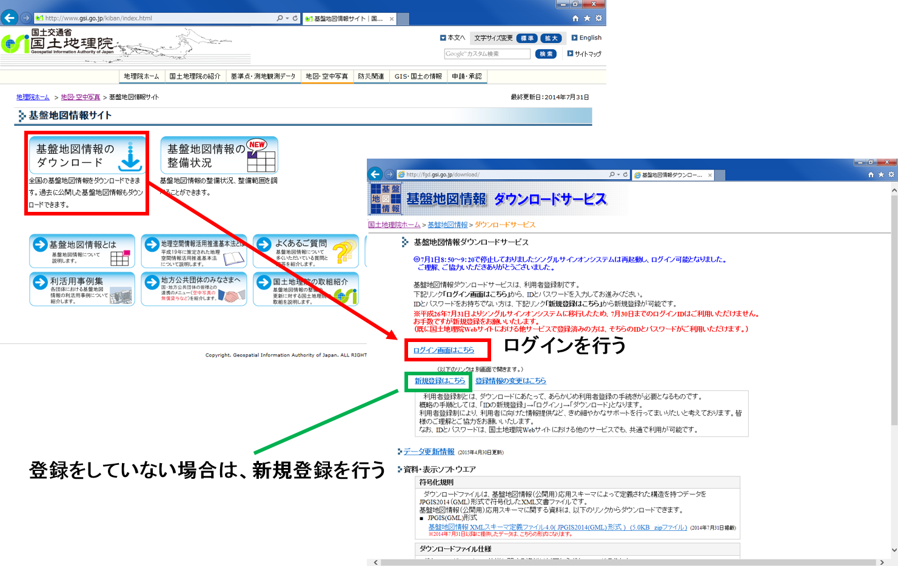
基盤地図情報のダウンロードをクリックし、ログインを行う。  
※登録をしていない場合は、新規登録を行う。

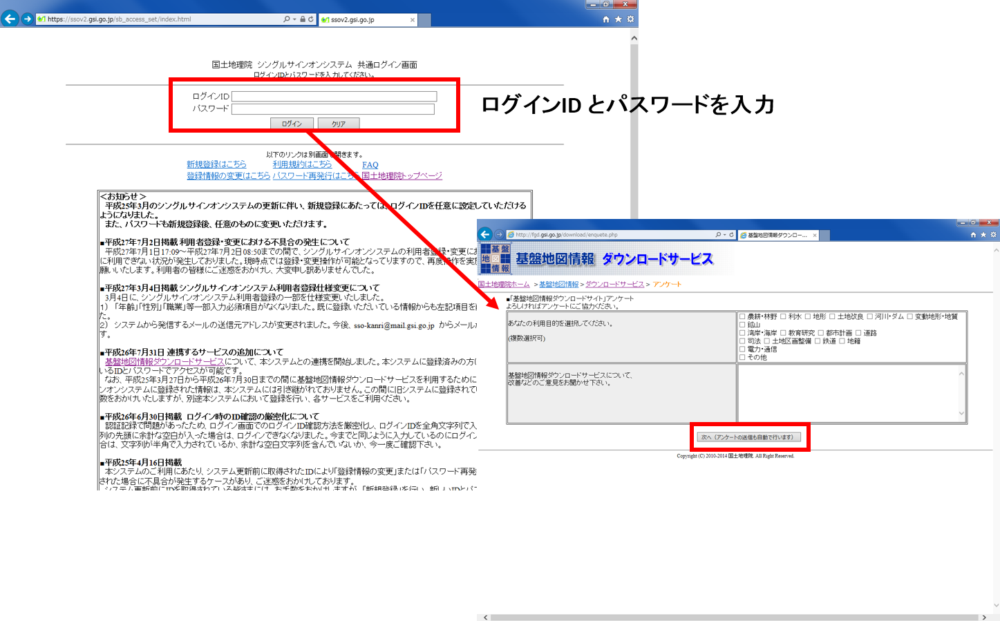
ログインIDとパスワードを入力する。  
アンケートを入力し、次へをクリックする。

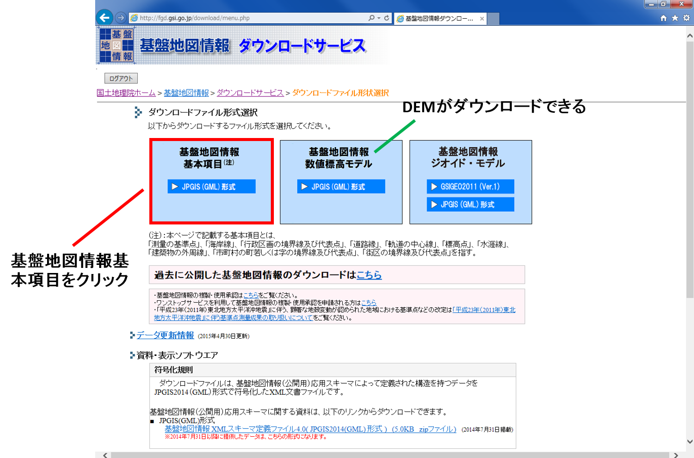
基盤地図情報基本項目をクリックし、基盤地図情報のダウンロード画面へ進む。

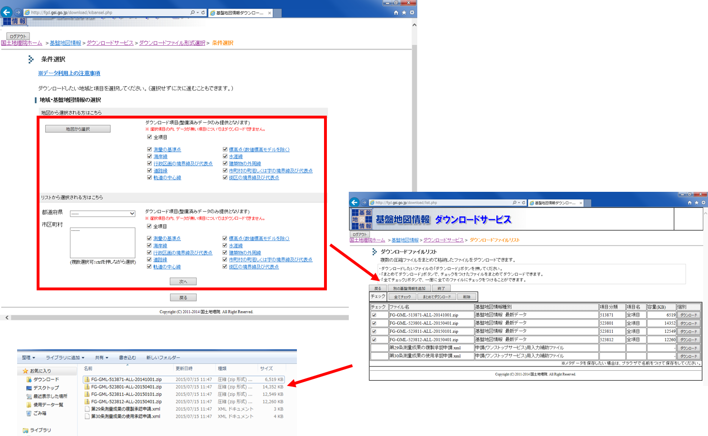
ダウンロードしたい基盤地図情報基本項目にチェックをいれ場所を選択し 次へ をクリックする。  
全てチェックをクリックし、まとめてダウンロードをクリックする。  
Zipファイルを解凍し、中のファイルを確認する。

### 基盤地図情報ビューアをダウンロードする

http://fgd.gsi.go.jp/download/menu.phpからビューアをダウンロードし、データをshapeファイルに変換する。
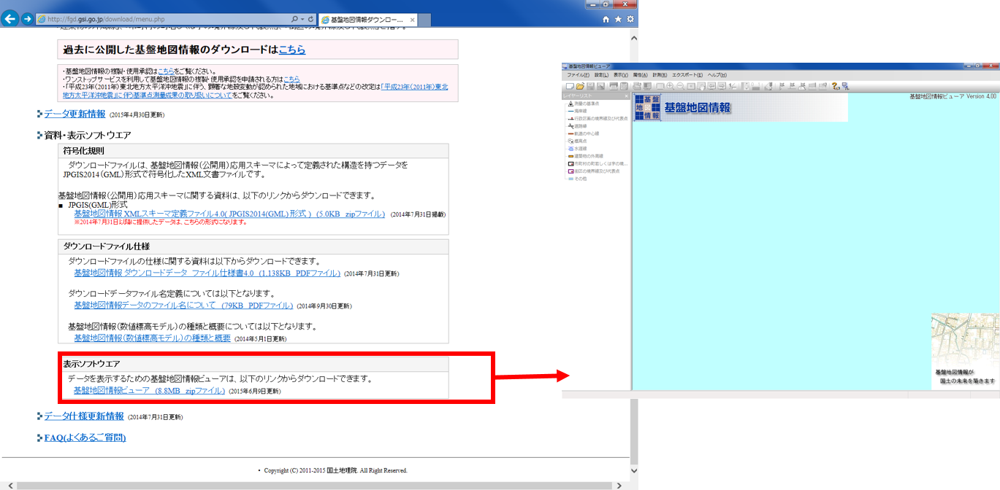
ダウンロードしたZipファイルを解凍し、.exeファイルを開くと、ビューアが立ち上がる。

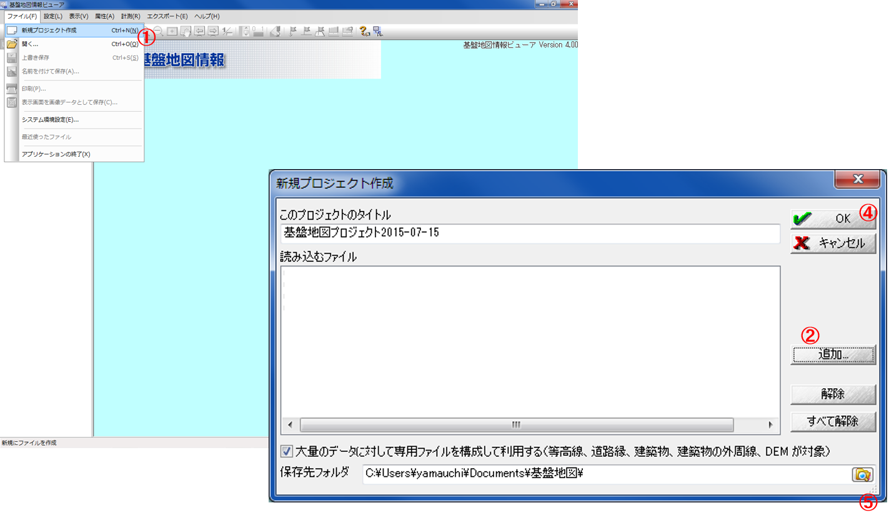
①ファイルを開き、新規プロジェクト作成をクリックする。  
②追加からダウンロードしたファイルを選択。  
③保存先フォルダを作成し、指定する。  
④OKをクリック。  
しばらくすると、データが表示される。
読み込むデータの量によってフリーズすることがあるので注意する。

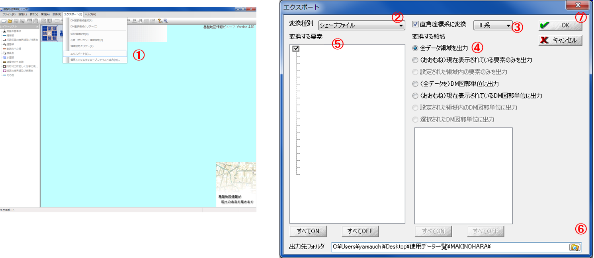
①エクスポートをクリックする。  
②シェープファイルを選択する。  
③8系を選択する（データによって変わるため注意する）。  
④全データ領域を出力にチェック（データ量によって変えること）する。
⑤全てにチェックをつける（データ量や目的によって変えること）する。  
⑥出力先のフォルダを選択する。  
⑦OKをクリックする。  
※変換が終わるまで時間がかかる（途中でフリーズの可能性あり）。  

  [▲メニューへもどる]  
[▲メニューへもどる]:既存データの地図データと属性データ.md#menu
## <a name = 国土交通省のGISデータ国土数値情報>国土交通省のGISデータ国土数値情報

[国土数値情報]のサイトにアクセスする。

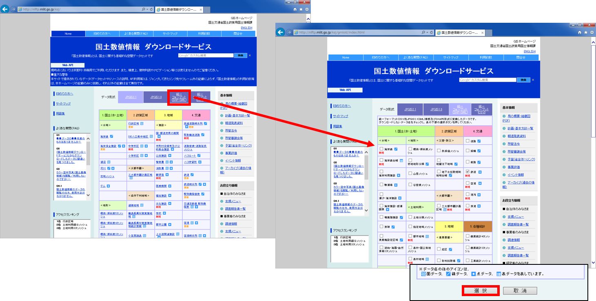
統一フォーマット（SHP・GML）をクリックする。
必要な項目にチェックをいれて、下段の選択をクリックする。
[国土数値情報]:<http://nlftp.mlit.go.jp/ksj/>

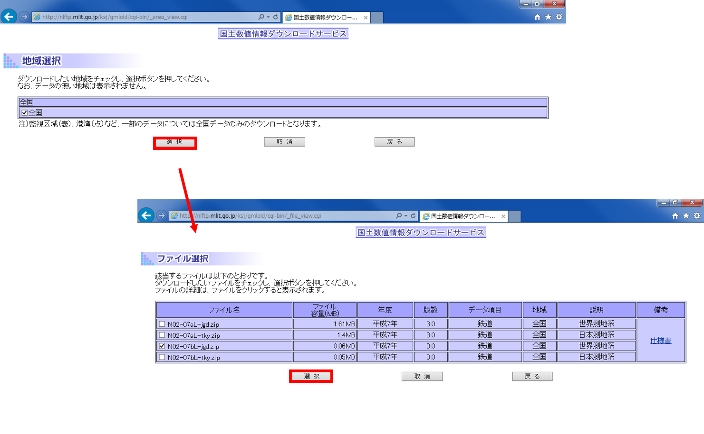
地域にチェックをいれ選択をクリックする。  
ダウンロードしたい項目にチェックをいれ、選択をクリックする。

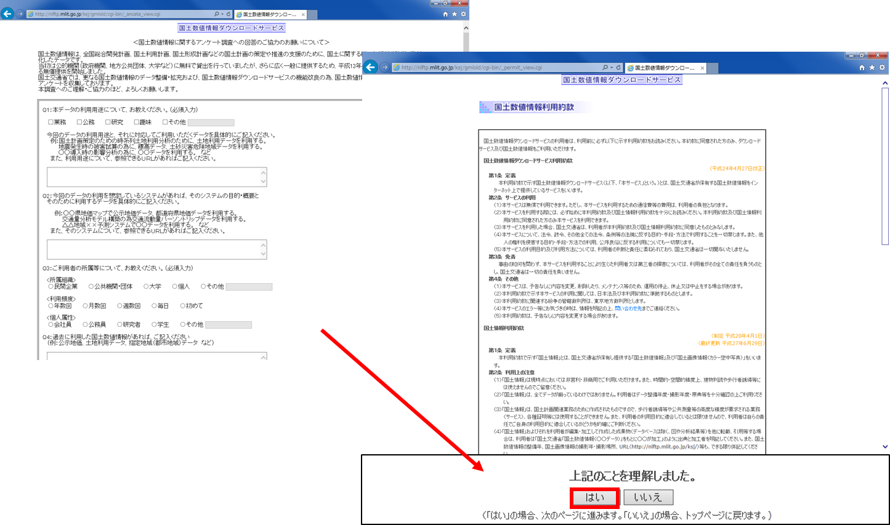
アンケートに回答し、利用約款を読み はい をクリックする。

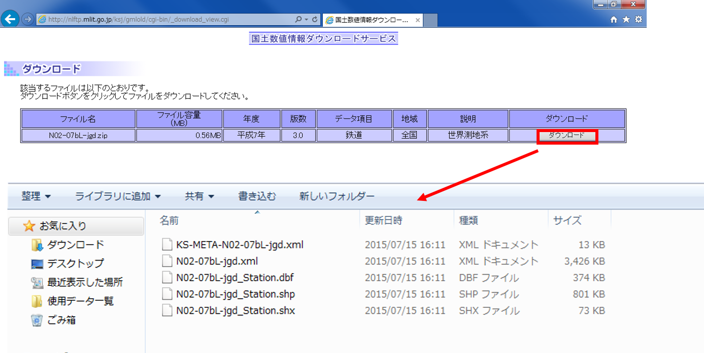
ダウンロードをクリックする。  
ダウンロードしたファイルを解凍し、中のファイルを確認する。

  [▲メニューへもどる]  
## <a name = 環境省のGISデータ>環境省のGISデータ
[生物多様性]のサイトにアクセスする。
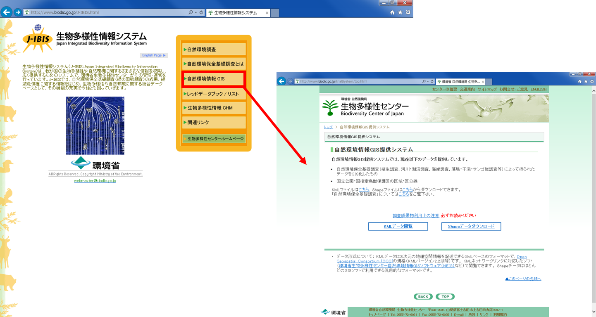
[生物多様性]:<http://www.biodic.go.jp/J-IBIS.html>
自然環境GISをクリックする。
KMLファイルとShapeファイルが選択できる。

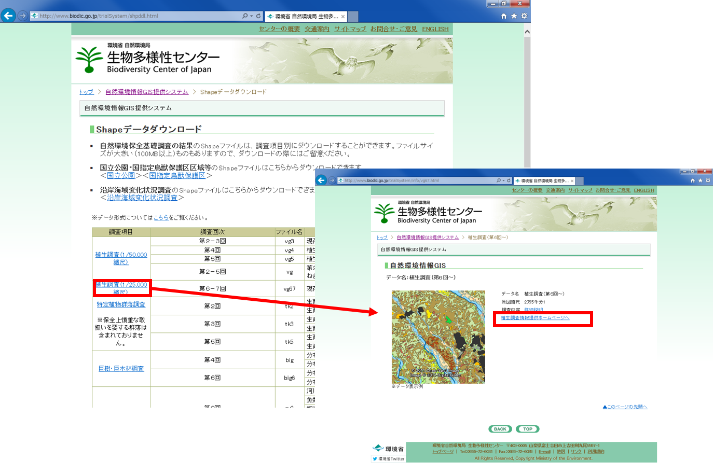
取得したいデータを選択し、ダウンロード画面へ進む。

地図で場所を選択し、GISデータ（シェープファイル）をダウンロードする。

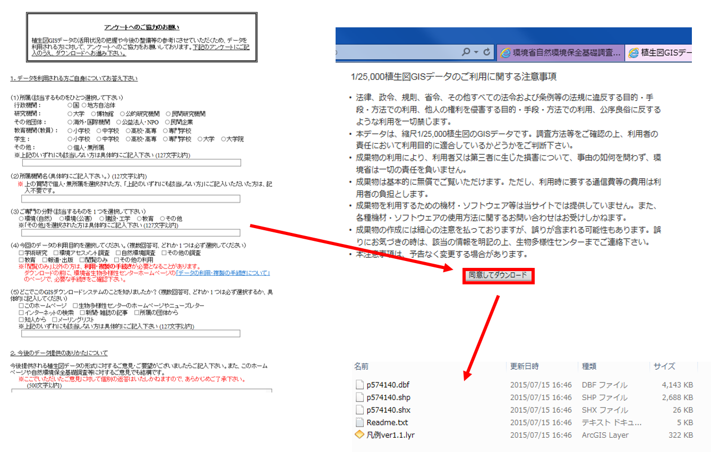
アンケートに回答し、注意事項に同意し、データのダウンロードを行う。

  [▲メニューへもどる]  
## <a name = 総務省のGISデータ>総務省のGISデータ
[e-Stat]のサイトにアクセスする。
このサイトでは、国勢調査、経済センサス、事務所・企業統計調査、農林業センサスなどがダウンロードできる。
[e-Stat]:<http://www.e-stat.go.jp/SG1/estat/eStatTopPortal.do>
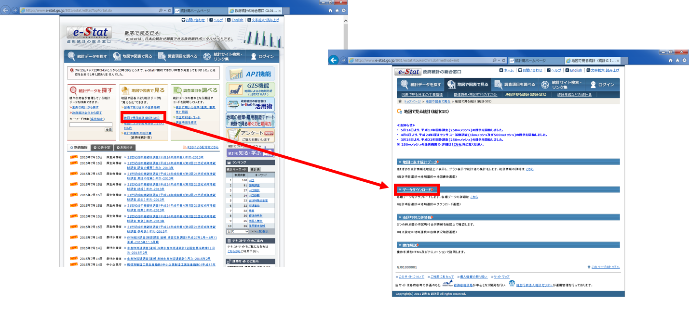
地図で見る統計（統計GIS）をクリックし、データダウンロードをクリックする。

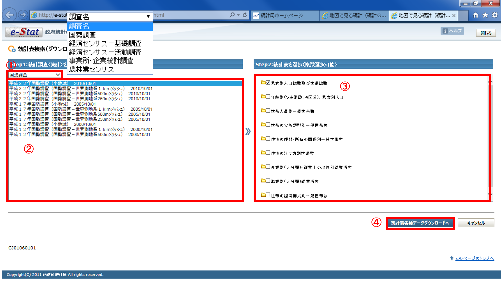
①調査の種類を選択する。  
②調査の年代、データ種類を選択する。  
③調査の項目を選択する。  
④統計各種データダウンロードへをクリックする。

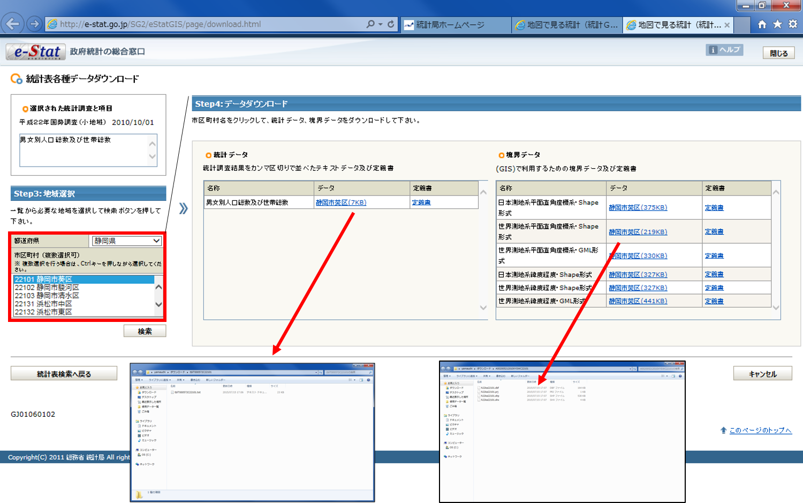
地域を選択してデータをダウンロードする。
境界データをダウンロードする際は、データの違いに注意する。

  [▲メニューへもどる]  
## <a name = その他のGISデータ>その他のGISデータ
### 属性データを地図化するためのデータ
[Municipality map]のサイトにアクセスする。
市区町村区域のGISデータをダウンロードすることができる。
[Municipality map]:<http://www.tkirimura.com/mmm/>
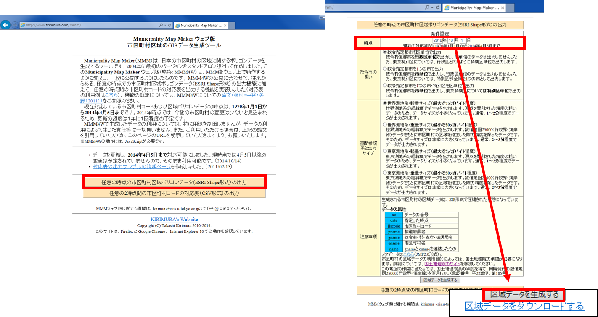
ダウンロードしたい年月を選択し、区域データを生成するをクリックする。

### 地方自治体のGISデータ
地方自治体は様々なデータをWeb GISで公開している。
ダウンロードできるものと、閲覧のみのものがある。  

**(例)**  
* [ぎふ県域統合型GIS]
* [おかやま全県統合型GIS]    
* [静岡県統合基盤地理情報システム]
* [京都府・市町村共同_統合型地理情報システム（GIS）]     
* [長野県統合型地理情報システム]

[ぎふ県域統合型GIS]:https://gis-gifu.jp/gifu/portal/index.html
[おかやま全県統合型GIS]:http://www.gis.pref.okayama.jp/map/top/index.asp
[静岡県統合基盤地理情報システム]:http://www.gis.pref.shizuoka.jp
[京都府・市町村共同_統合型地理情報システム（GIS）]:http://g-kyoto.gis.pref.kyoto.lg.jp/g-kyoto/top/
[長野県統合型地理情報システム]:http://www3.pref.nagano.lg.jp/gis/top/

  [▲メニューへもどる]  

## <a name = オープンデータ>オープンデータ
>オープンデータとは、政府において、オープンデータとは、「機械判読に適したデータ形式で、二次利用が可能な利用ルールで公開されたデータ」であり「人手を多くかけずにデータの二次利用を可能とするもの」のことを言います。  
[総務省オープンデータ戦略の推進]より引用
[総務省オープンデータ戦略の推進]:<http://www.soumu.go.jp/menu_seisaku/ictseisaku/ictriyou/opendata/>

- 自治体が、様々な情報をCSV、Shapeデータで配信している。
- オープンデータを利用した地図アプリなども普及している。

### オープンデータのダウンロード

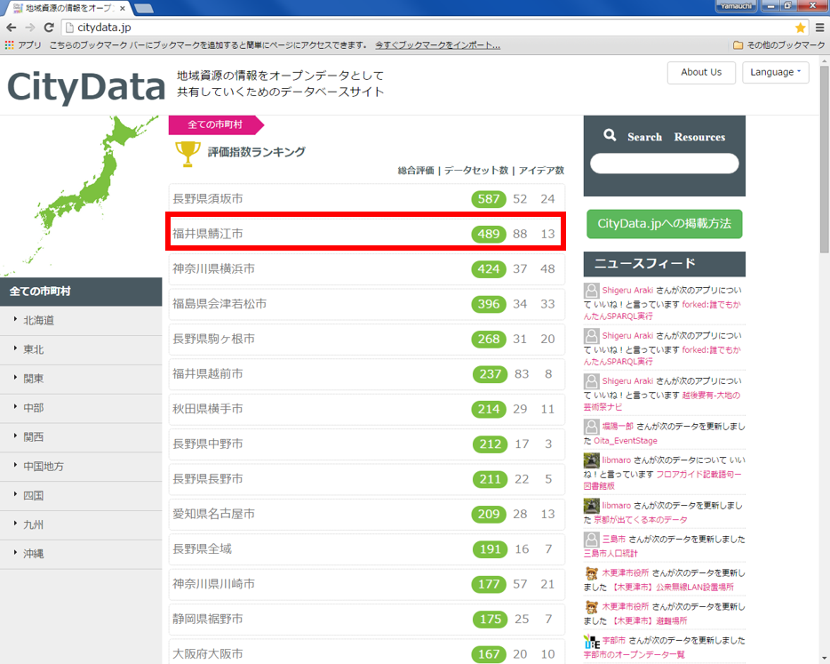  
この教材では、[CityData]のサイト（オープンデータのデータベースサイト）にアクセスする。  
市町村ごとに、ダウンロードできるデータがまとめられている。  
今回は、鯖江市のオープンデータを閲覧する。  
※　[CityData]とは別に自治体のページで公開している場合もある。
[CityData]:<http://citydata.jp/>

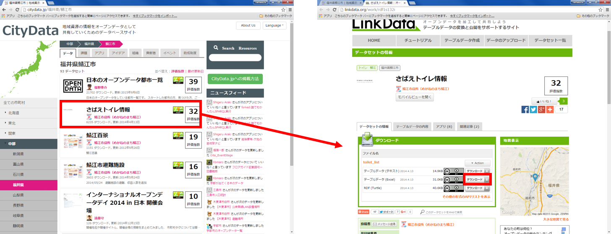
福井県鯖江市のオープンデータから、さばえトイレ情報をダウンロードする。

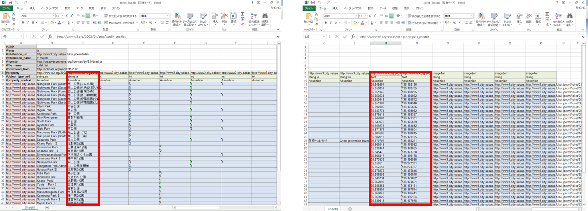
ダウンロードしたエクセルを開くと、トイレの設置場所の名称や緯度経度が記入されている。  
名前をつけて保存でCSV形式にすると、QGISで読み込むことができる。

  [▲メニューへもどる]  
