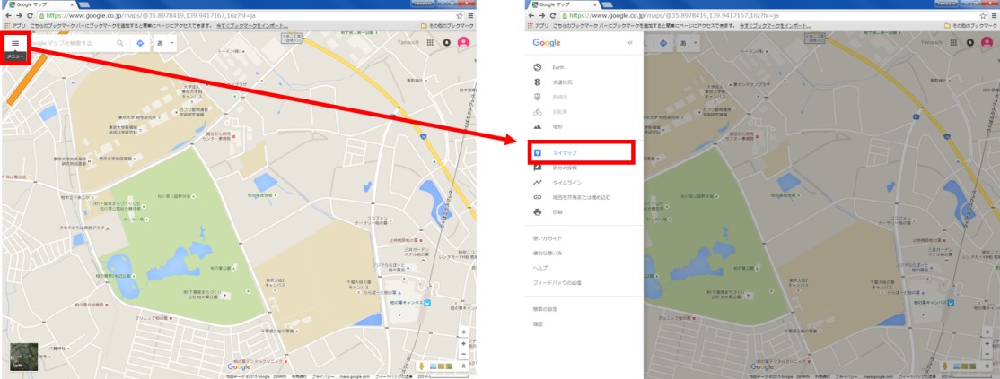
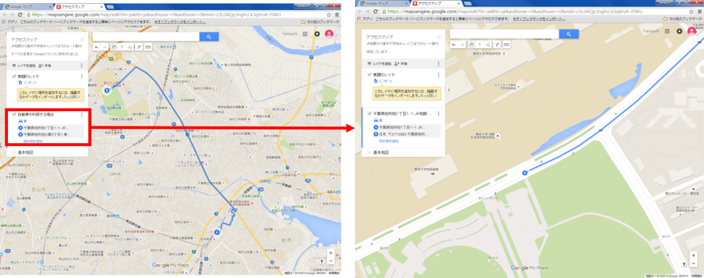
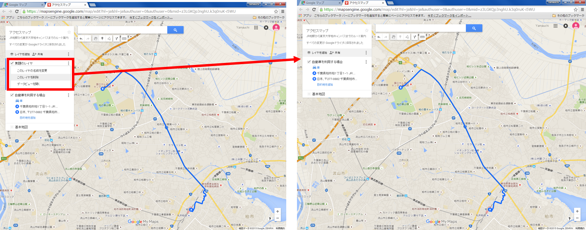
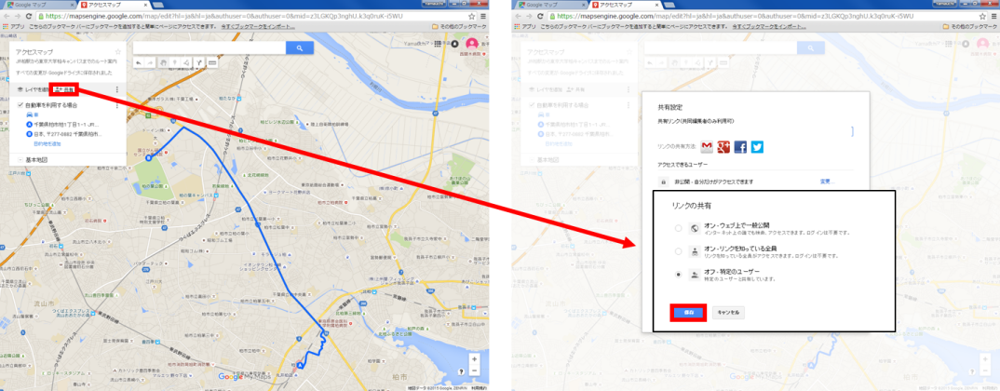
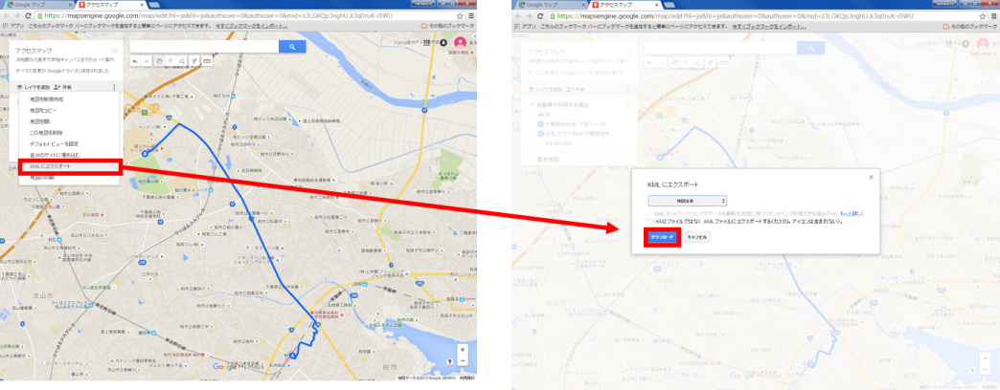
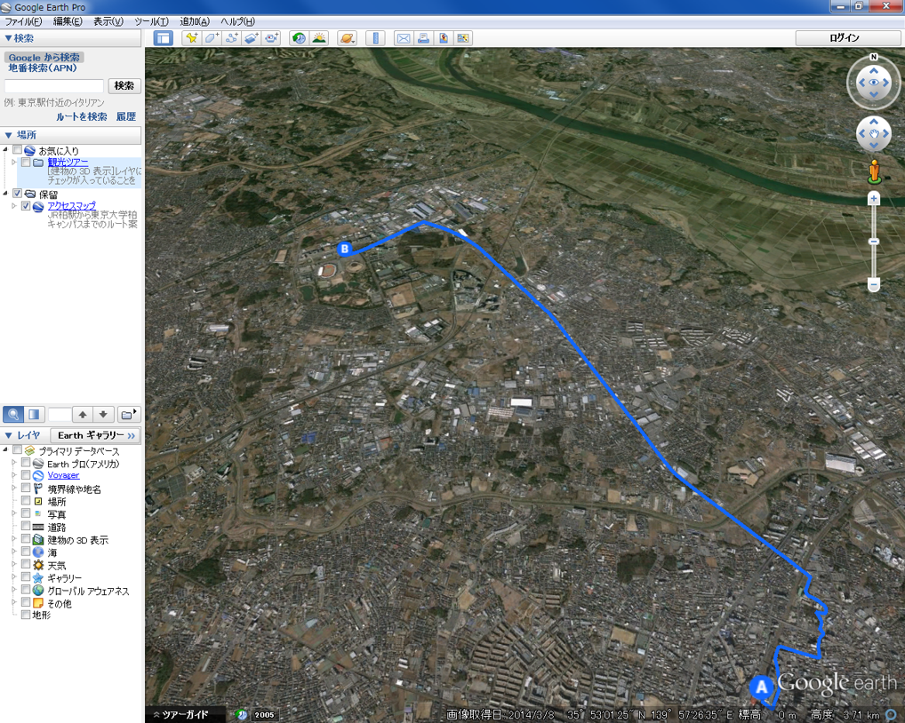

# Googleマイマップの活用
本教材は、Googleマイマップを用いて空間データを表示、作成、検索などの手法について解説しています。Googleマイマップの機能を利用し、ルート検索などを行います。
本教材を使用する際は、[利用規約]をご確認いただき、これらの条件に同意された場合にのみご利用下さい。

[利用規約]:https://github.com/yamauchi-inochu/demo/blob/master/利用規約.md
**Menu**  

-------
* JR柏駅―東京大学柏キャンパス間のアクセスマップを作成する。

**スライド教材**  
スライドのダウンロードは[こちら]
[こちら]:https://github.com/yamauchi-inochu/demo/raw/master/Markdown/%E3%82%A4%E3%83%B3%E3%82%BF%E3%83%BC%E3%83%8D%E3%83%83%E3%83%88%E3%81%AE%E6%B4%BB%E7%94%A8%E3%81%AB%E9%96%A2%E3%81%99%E3%82%8B%E6%95%99%E6%9D%90/Google%20%E3%83%9E%E3%82%A4%E3%83%9E%E3%83%83%E3%83%97%E3%81%AE%E6%B4%BB%E7%94%A8/Google%20%E3%83%9E%E3%82%A4%E3%83%9E%E3%83%83%E3%83%97%E3%81%AE%E6%B4%BB%E7%94%A8.pptx
--------

  
[Google maps]にアクセスしGoogleマップを開く。  
検索ボックスの左にあるメニューボタンからマイマップを選択する。  
※Googleアカウントでログインしておく。
[Google maps]:<https://www.google.co.jp/maps>

  
地図を作成をクリックすると新たにウインドウが立ち上がり、マイマップの編集画面が表示される。  
無題の地図をクリックし、地図のタイトルと説明を入力する。

  
ラインの作画ボタンをクリックし、運転ルートの追加をクリックする。  
無題のレイヤをクリックし、レイヤ名を変更しておく。

  
AにJR柏駅、Bに東京大学柏図書館を入力する（予測変換で表示された住所を利用する）。  
A,Bを入力すると自動でルートが生成される。  
Bのレイヤを移動し、微調整をしておく。  

  
レイヤの右にあるボタンから、このレイヤを削除を選択する。
余分なレイヤを削除し、地図を整える。

  
「共有」から、地図の共有設定を確認しておく。  
サイトで埋め込む場合は、一般公開を選択する。

  
KMLにエクスポートを選択すると、データを保存することができる。

  
保存した地図をGoogle Earth Proで表示

[▲メニューへもどる]
[▲メニューへもどる]:Googleマイマップの活用.md#menu
