# MAP boxでWeb MAPを作成
本教材は、MAPboxを用いてインターネットによる地図データの作成や公開について解説しています。アカウントを取得し、データの作成と公開を行います。  
講義用教材として、[地理情報科学教育用スライド（GIScスライド）]の4章が参考になります。  

本教材を使用する際は、[利用規約]をご確認いただき、これらの条件に同意された場合にのみご利用下さい。

[利用規約]:https://github.com/yamauchi-inochu/demo/blob/master/利用規約.md

**Menu**
------
* [アカウントの取得](#アカウントの取得)
* [Mapboxでレイヤを作成する](#Mapboxでレイヤを作成する)
* [データのエクスポート](#データのエクスポート)
* [データの読み込み](#データの読み込み)

**使用データ**

* [越前市オープンデータ] 越前市防災安全課　一次避難場所（風水害）、浸水想定区域（風水害）のデータを加工し、利用。

[越前市オープンデータ]:http://www.city.echizen.lg.jp/office/010/021/open-data-echizen.html

**スライド教材**
スライドのダウンロードは[こちら]
[こちら]:https://github.com/yamauchi-inochu/demo/raw/master/Markdown/%E3%82%A4%E3%83%B3%E3%82%BF%E3%83%BC%E3%83%8D%E3%83%83%E3%83%88%E3%81%AE%E6%B4%BB%E7%94%A8%E3%81%AB%E9%96%A2%E3%81%99%E3%82%8B%E6%95%99%E6%9D%90/MAP%20box%E3%81%A7Web%20MAP%E3%82%92%E4%BD%9C%E6%88%90/MAP%20box%E3%81%A7Web%20MAP%E3%82%92%E4%BD%9C%E6%88%90.pptx

-------

## アカウントの取得
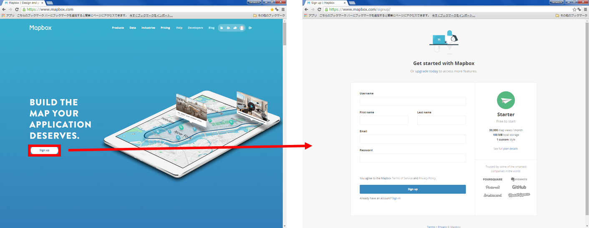
[MAP boxの公式サイト]にアクセスして、アカウントを作成する。
[MAP boxの公式サイト]:https://www.mapbox.com

### 読み込むデータを変換しておく
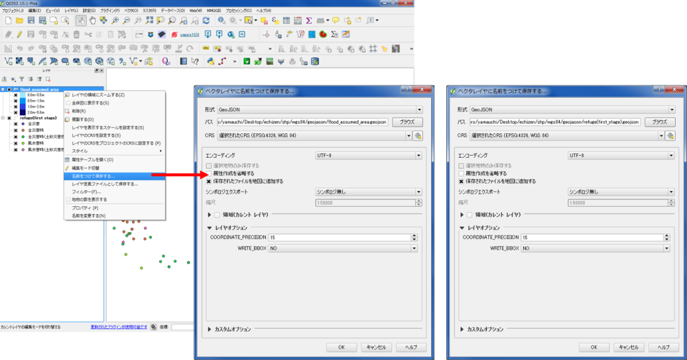
越前市のポイントデータとポリゴンデータをGeoJSON形式で保存する。

[▲メニューへもどる]  
[▲メニューへもどる]：

## Mapboxでレイヤを作成する
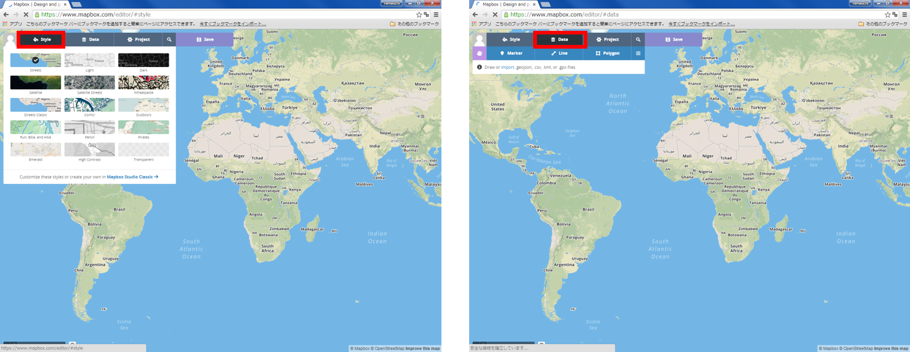
Style:basemapを選択することができる。  
Data:ポイント、ライン、ポリゴンを手書きで作成できる。  
Project:データのエクスポートなどができる。  

### ポイントの追加
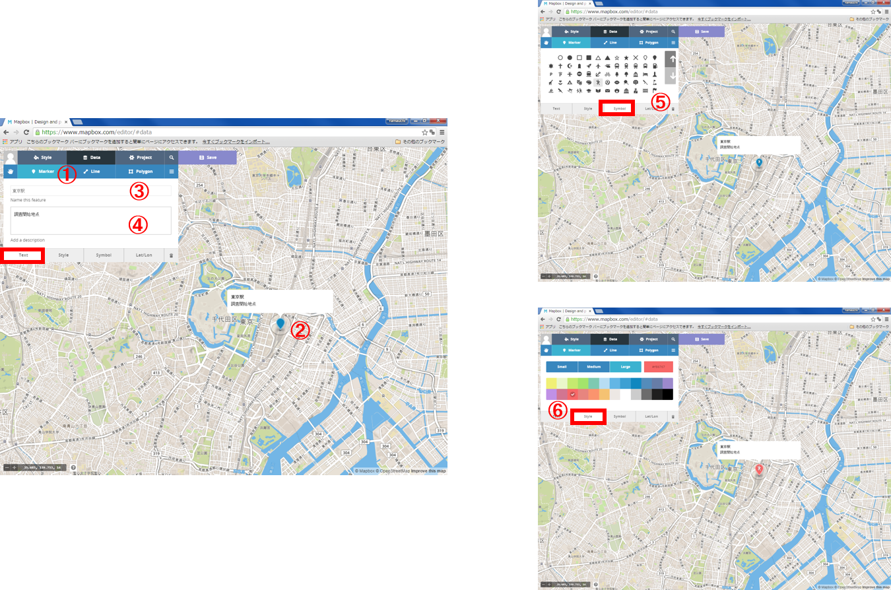
① Marker をクリックする。  
② 任意の点を追加する。  
③ ポイントの名前を入力する。  
④ ポイントの詳細を入力する。  
⑤ マーカーのスタイルを変更する。  
⑥ マーカーの色を変更する。  

### ラインとポリゴンを追加
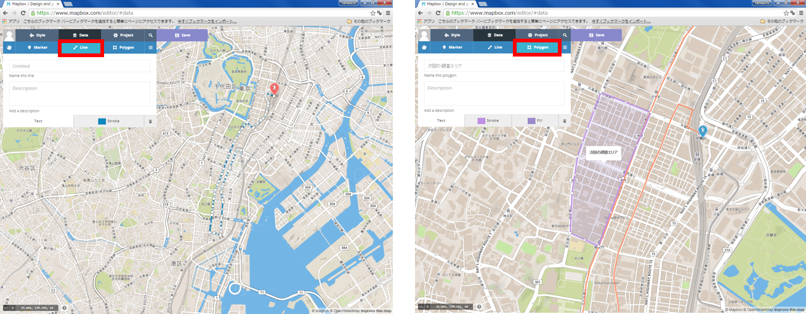
ポイントの追加と同じように、ラインとポリゴンを追加することができる。

[▲メニューへもどる]  

## データのエクスポート
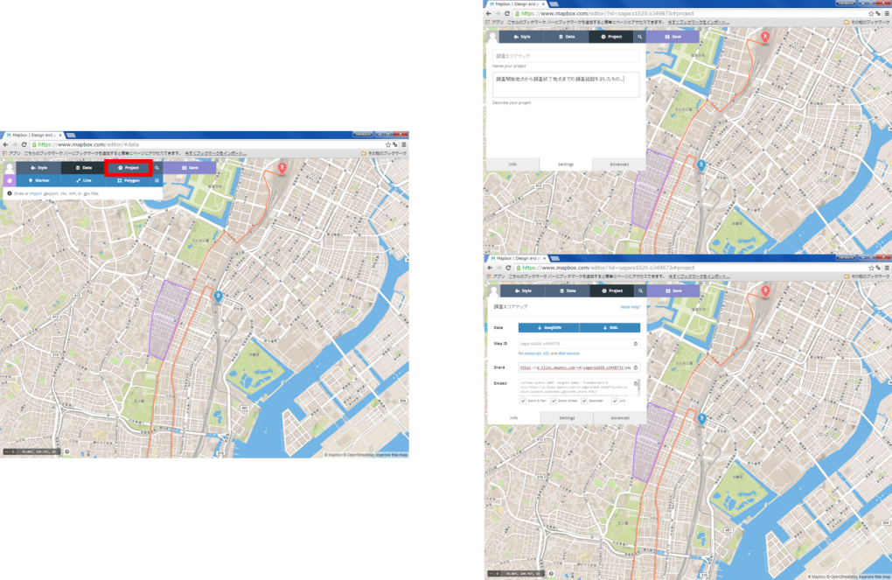
① Projectをクリックし、地図のタイトルと詳細を入力する。  
② web地図として保存（shareのurl）する。  
③ データとして保存（kml と GeoJSON）する。  

### ブラウザで地図を表示する
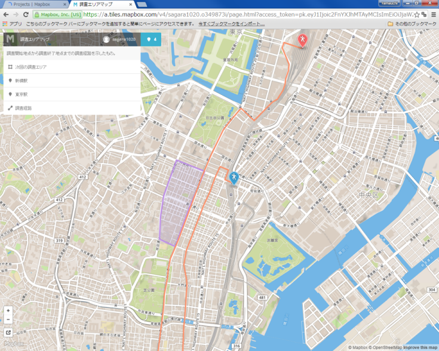

### エクスポートしたデータを確認する
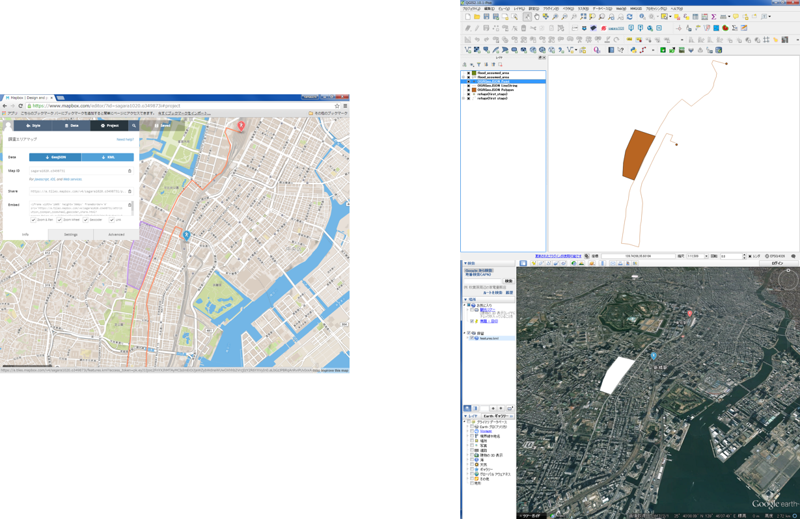
QGIS GoogleEarthなどで、エクスポートしたデータ（kml GeoJSON）を確認する。

[▲メニューへもどる]  

## データの読み込み
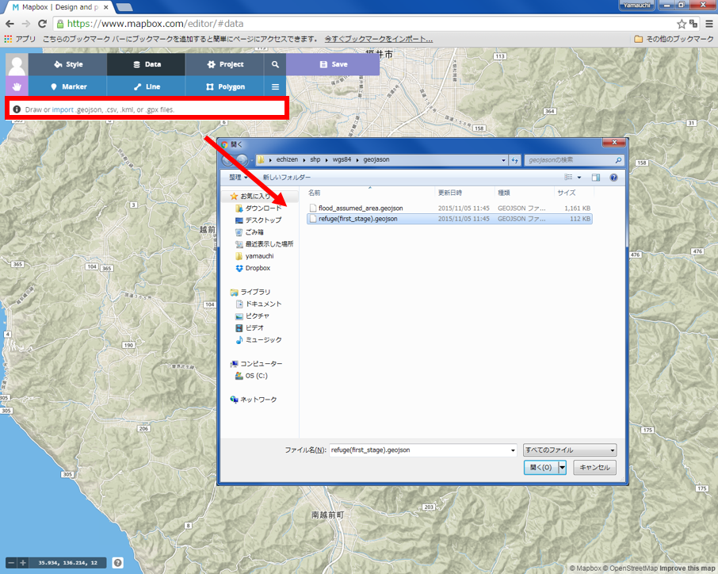
QGISで、保存した GeoJSONを選択し、インポートする。

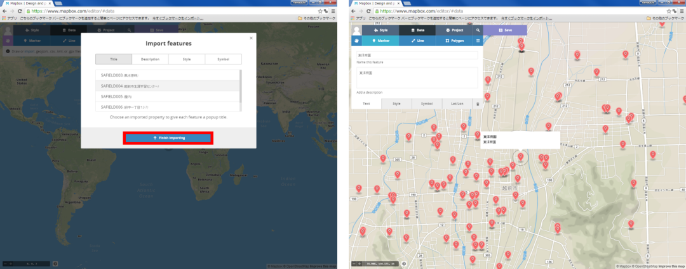
データの表示項目やスタイルを選択し、「Finish Importing 」 をクリックする。

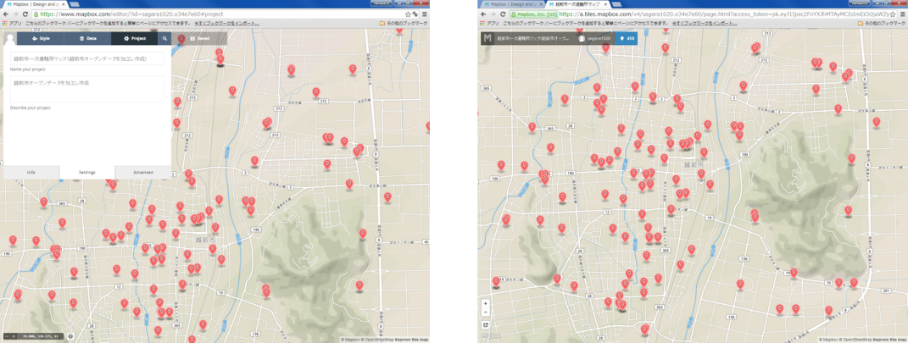
プロジェクトの設定をし、ブラウザで表示する。

[▲メニューへもどる]  
